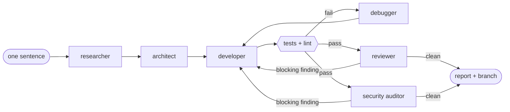

<div align="center">

# 🪆 Swarm

### One sentence in. A tested, reviewed, security-audited change out.

A software team of AI agents inside a pipeline that does not take their word for it:<br>
real test runs decide what passes, a guard decides what they may touch, and your PC comes first.


</div>



## Why it is different

| | |
|---|---|
| 🧪 **Gates, not promises** | An agent saying "tests pass" counts for nothing. The pipeline runs your real test and lint commands and reads the exit code. |
| 🛡️ **A guard on every tool call** | Agents that read the open web cannot write or execute. Reviewers are read-only. Nothing deploys, publishes or spends by itself. |
| 💸 **Cheapest engine that can do the job** | No model for checks, a local model (Ollama) for small jobs, a cloud model only when needed. Hard budget per run. |
| 🎮 **Your PC stays yours** | Game or call running? Local work drops to background, moves off the GPU, or waits. |
| 🌙 **Runs unattended** | `swarm autopilot` works a queue overnight, pauses at your plan limit and resumes after it. |
| 👀 **You can watch it think** | A local dashboard shows who is working on what, on which engine, with test gates landing live. |

## Try it in two minutes

```powershell
git clone https://github.com/JSingh9536/Swarm.git; cd Swarm
python -m venv .venv; .\.venv\Scripts\pip install -e ".[dev]"

.\.venv\Scripts\swarm demo      # a scripted team through the real pipeline: free, offline, no login
.\.venv\Scripts\swarm doctor    # checks login, tools and the guard
```

Then give it real work:

```powershell
swarm run "add a /health endpoint with a test" -p .\my-project    # the full team
swarm run --local "write docstrings for utils.py" -p .\my-project # local model, no cloud tokens
swarm review -p .\my-project                                      # independent code + security review
swarm audit  -p .\my-project                                      # whole-codebase security audit
swarm autopilot --dry-run                                         # what the queue would run, and on which engine
```

Cloud runs use a [Claude Code](https://claude.com/claude-code) login; local runs use [Ollama](https://ollama.com). `swarm --help` lists the rest (`research`, `status`, `load`, `hardware`, `flow`, `company`).

## Watch it work

```powershell
cd ui; ..\.venv\Scripts\python.exe -m swarm_ui
```

One page, light or dark, fine on a phone: what the swarm is doing right now, the work queue, the autopilot log, PC health, usage, and a live network view of the agents handing work to each other. It listens on `127.0.0.1` only, with a fresh token per launch. Details in [`ui/README.md`](ui/README.md).

## Under the hood

| Path | What lives there |
|---|---|
| `src/swarm/pipeline.py` | the process: plan, build, gate, fix, review, in bounded loops |
| `src/swarm/guard.py` | the tool policy, tested in both directions (blocks the bad, allows the good) |
| `src/swarm/gates.py` | real test and lint runs |
| `src/swarm/load.py` | reads what the PC is doing and picks the engine |
| `src/swarm/autopilot.py` | the unattended queue worker (copy [`queue.example.json`](queue.example.json) to `queue.json`) |
| `.claude/agents/` | the nine role prompts, also usable as slash commands: `/team-build`, `/team-fix`, `/team-review`, `/team-research` |
| `ui/` | the dashboard: standard library only, no build step |
| `docs/operating-model.md` | how work is routed, and why |

The guard is defense in depth, not a sandbox. Run the swarm on projects you would let a new colleague work on.

<div align="center"><sub>MIT licensed · Python 3.11+ · every test runs offline and costs nothing</sub></div>
